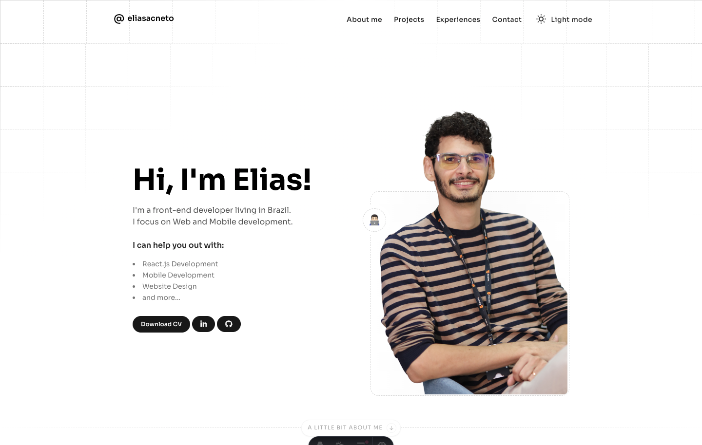
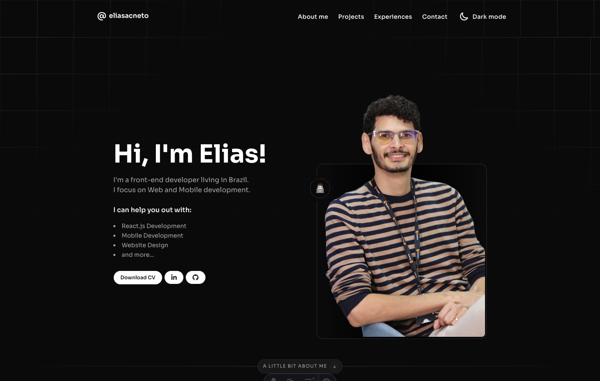

# 🙋🏻‍♂️ Hi, this is the portfolio's repo page

Welcome to my portfolio repository! This is a showcase of my work as a front-end developer, focusing on web and mobile development, built using Astro.js.

→ [Live demo](https://eliasacneto.vercel.app)

## 💭 About Me

I hold a degree in Analysis and Systems Development, boasting solid experience in project management, user-friendly UI/UX interface development, website and web application creation, seamlessly integrating agile methodologies with programming best practices. I have a genuine passion for programming and I'm an advocate for usability and innovation-related themes!

## ⚡️ Stacks

- Astro.js
- HTML5
- CSS3
- TypeScript
- JSON

## 📸 Screenshot

  
  

